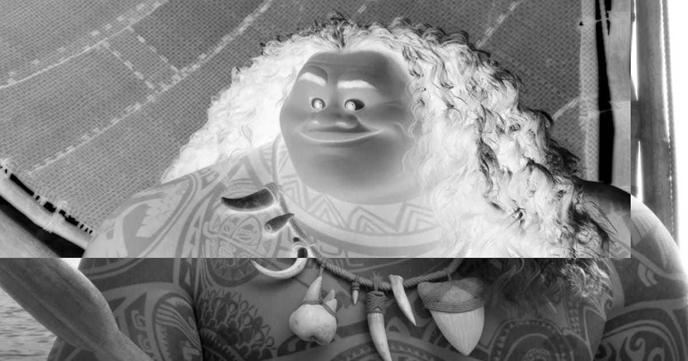
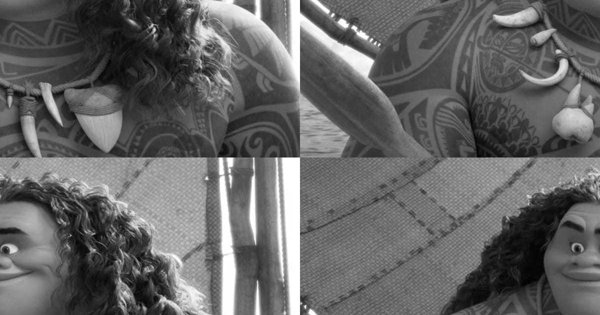
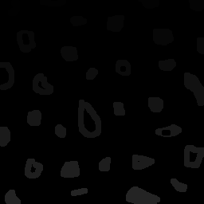
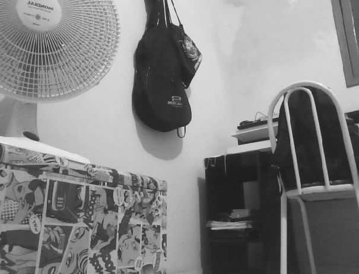
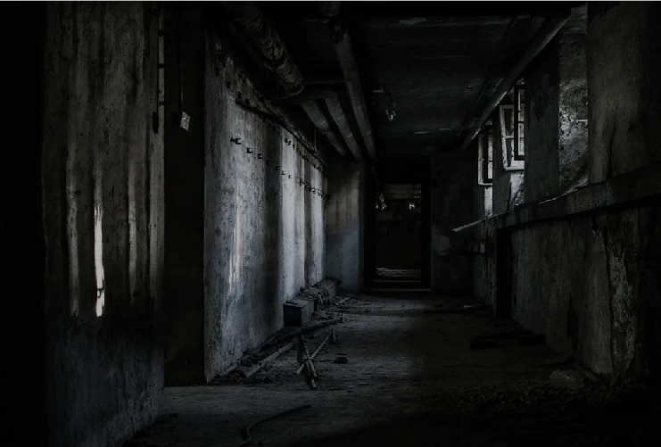
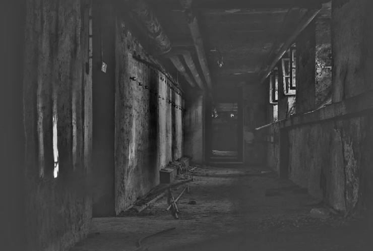
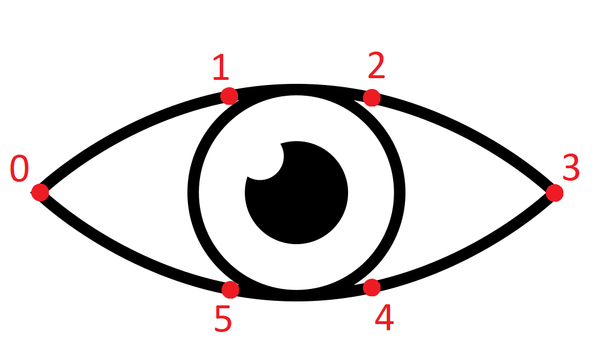

# Digital_Image_Processing

Esta página é dedicada à publicar os trabalhos realizados para a disciplina de Processamento Digital de Imagens, ministrada pelo professor Agostinho Brito, e realizado pelos alunos Rhendson Alexandre e Mário Marques, utilizando a biblioteca OpenCV em linguagens como Python e C++.

## 1. Manipulando Pixels de uma Imagem

### 1.1. Inverter Cores da Região Especificada

Primeiramente, pegaremos a imagem do personagem Maui de Moana para realizar a primeira manipulação, a de selecionar a área de um retângulo dentro da imagem a qual determinará a área que terá as cores invertidas.
<div align="center">

</div>
<div align="center">
<figcaption>Imagem Original</figcaption>
</div>

```python
from tempfile import tempdir
import numpy as np
import cv2 as cv

def showImage( img ):
    from matplotlib import pyplot as plt
    plt.imshow(img)
    plt.show()
    
def getColor(img, i, j):
    return img.item(i, j, 0), img.item(i, j, 1), img.item(i, j, 2)

```
O programa começa chamando as bibliotecas necessárias, criando uma função ```showImage()```, usada apenas para plotar a imagem recebida como parâmetro, e a função ```getColor()```, a qual armazenas os canais de cores da imagem separadamente.
```python
def setColor(img, i, j, b, g, r):
    img.itemset((i, j, 0), b)
    img.itemset((i, j, 1), g)
    img.itemset((i, j, 2), r)
    return 

def invertRegions( img ):
    y1 = input('y1: ')
    x1 = input('x1: ')
    y2 = input('y2: ')
    x2 = input('x2: ')

    rectangle = img[int(y1):int(y2), int(x1):int(x2)]
    altura, largura = rectangle.shape

    for i in range (0, altura):
        for j in range(0, largura):
            rectangle.itemset((i, j), 255-(rectangle.item(i, j)))

    img[int(y1):int(y2), int(x1):int(x2)] = rectangle

    cv.imwrite("/imgs/maui_inverted.png", img)

    return img 

img = cv.imread("imgs/maui.jpg", 0)
showImage(invertRegions(img))
    
    
```
Em seguida, a função ```setColor()``` seleciona a área a ser modificada de acordo com os inputs do usuário usando a função ```invertRegions()```, a qual também realiza a inversão das cores ponto a ponto com o looping. Ao final de tudo, a imagem será salva em tons de cinza e com as cores invertidas, como no exemplo abaixo:

<div align="center">

</div>
<div align="center">
<figcaption>Imagem com cores invertidas e em tons de cinza</figcaption>
</div>

### 1.2. Trocar Regiões da Imagem

Se baseando novamente na mesma imagem original, este algoritmo troca posições dividindo a imagem em 4 pedaços iguais e embaralhando-os. Para isso, as mesmas bibliotecas do exercício 1.1 serão usadas.

```python
from tempfile import tempdir
import numpy as np
import cv2 as cv

def showImage( img ):
    from matplotlib import pyplot as plt
    plt.imshow(img)
    plt.show()

def cutOffQuarter( img, quarter ):
    altura, largura = img.shape

    first_quarter = img[0:int(altura/2), 0:int(largura/2)]
    second_quarter = img[0:int(altura/2), int(largura/2):largura]
    third_quarter = img[int(altura/2):altura, 0:int(largura/2)]
    fourth_quarter = img[int(altura/2):altura, int(largura/2):largura]

    if quarter == 1 :    
        return first_quarter 
    elif quarter == 2 :    
        return second_quarter 
    elif quarter == 3 :    
        return third_quarter 
    elif quarter == 4 :    
        return fourth_quarter 
```
A primeira grande mudança em relação ao exercício anterior é a função ```cutOffQuarter()``` a qual divide a imagem original em 4 pedaços iguais usando metade da altura e de largura para realizar os cortes nomeados de 1 a 4.
```python

def trocaRegioes( img ):
    cv.imwrite("imgs/temp_shift.png", img)
    tempImg = cv.imread("imgs/temp_shift.png", 0)

    altura, largura = img.shape

    tempImg[0:int(altura/2), 0:int(largura/2)] = cutOffQuarter(img, 4)
    tempImg[0:int(altura/2), int(largura/2):largura] = cutOffQuarter(img, 3)
    tempImg[int(altura/2):altura, 0:int(largura/2)] = cutOffQuarter(img, 2)
    tempImg[int(altura/2):altura, int(largura/2):largura] = cutOffQuarter(img, 1)

    return tempImg

def main():
    img = cv.imread("imgs/maui.jpg", 0)
    cv.imwrite("imgs/maui_shifted.png", trocaRegioes(img))
    showImage(trocaRegioes(img))

main()
```
A segunda grande parte do algoritmo é focado na função ```trocaRegioes()```, que pega os parâmetros obtidos por meio da função anterior ao calcular o tamanho de pixels máximos de altura e largura, copia a imagem original em tons de cinza para um arquivo temporário de imagem ```temp_sift.png``` e usar ela de base para trocar a posição dos pedaços gerados e salvar o resultado em uma outra imagem, disponível abaixo:

<div align="center">

</div>
<div align="center">
<figcaption>Imagem com as regiões trocadas e em tons de cinza</figcaption>
</div>

## 2. Rotulação de Objetos usando Floodfill

<div align="center">

</div>
<div align="center">
<figcaption>Imagem com as bolhas a serem rotuladas</figcaption>
</div>

```python
from turtle import color
import numpy as np
import cv2 as cv

img = cv.imread("imgs/bolhas.png", 0)

floodfill = img.copy()

h, w = img.shape[:2]
mask = np.zeros((h+2, w+2), np.uint8)

```
Após carregar as bibliotecas necessárias, a imagem bolhas.png é lida e copiada para uma variável chamada floodfill. Um outro ponto importante para a execução do programa é a criação uma máscara
a qual é usada para varrer a figura e encontrar as bordas das bolhas.

```python

colorToFill = 1
for i in range (0, h):
    for j in range(0, w):
        if (img.item(i, j) == 255):
            cv.floodFill(floodfil, mask, (j,i), colorToFill)
            if (img.item(i+1, j+1) == colorToFill):
                colorToFill += 1

cv.imshow('Mask', mask)
cv.imshow('Original', img)
cv.imshow('FloodFill', floodfill)

cv.waitKey()

cv.destroyAllWindows()

```
Assim, com a máscara pronta, o algoritmo realiza uma série de loopings que varrem a figura completamente utilizando a máscara como base rotulando as bolhas conforme suas bordas.

<div align="center">

</div>
<div align="center">
<figcaption>Imagem das bolhas com o floodfil</figcaption>
</div>

## 3. Equalização de Histogramas

O algorítmo à seguir pega o video capturado pela câmera e mostra um histograma equalizado dessa captura em tons de cinza.

```python

import numpy as np
from matplotlib import pyplot as plt
import cv2 as cv

capture = cv.VideoCapture(0)

fig, ax = plt.subplots()
ax.set_title('Histogram (grayscale)')
ax.set_xlabel('Bin')
ax.set_ylabel('Frequency')

```
A câmera de video do computador passa a capturar as imagens e as armazena na variável "capture". Após isso, a preparação para o plot do histograma é realizado em uma janela própria.

```python

lw = 3
alpha = 0.5
bins = 64

lineGray, = ax.plot(np.arange(bins), np.zeros((bins,1)), c='k', lw=lw)

ax.set_xlim(0, bins-1)
ax.set_ylim(0, 1)
plt.ion()
plt.show()


while True:
    (grabbed, frame) = capture.read()

    if not grabbed:
        break


numPixels = np.prod(frame.shape[:2])

gray = cv.cvtColor(frame, cv.COLOR_BGR2GRAY)
cv.imshow('Grayscale', gray)
histogram = cv.calcHist([gray], [0], None, [bins], [0, 255]) / numPixels
lineGray.set_ydata(histogram)

fig.canvas.draw()

cv.waitKey(1)

capture.release()
cv.destroyAllWindows()

```


## 5. Filtragem no Domínio Espacial

Uma vez que os exercícios seguintes partiam de uma base de código em c++, chegamos a conclusão que seria inviável a adaptação de todos os códigos bases para python. Após esse ponto, o desenvolvimento dos códigos teve sua linguagem de programação mudada e usaremos C++. Para o exercício 5, foi tomado como base de código o programa [filtroespacial.cpp](../codes/filtroespacial.cpp).

O código em anexo é responsável por realizar a obtenção do vídeo da câmera em tempo real e aplicar, sobre ele, os seguintes filtros espaciais:
- Filtro da Média;
- Filtro Gaussiano;
- Filtro Sobel Horizontal;
- Filtro Sobel Vertical;
- Filtro Laplaciano;
- Filtro de Boost.

Diante disso, foi solicitada a inclusão de um novo filtro: Um Filtro Laplaciano do Gaussiano.

Após pesquisar na Literatura, encontramos a seguinte máscara para realizar o filtro Laplaciano do Gaussiano:
<div align="center">   
    
|   0   |   0   |  -1   |   0   |   0   |
| :---: | :---: | :---: | :---: | :---: |
|   0   |  -1   |  -2   |  -1   |   0   |
|  -1   |  -2   |  16   |  -2   |  -1   |
|   0   |  -1   |  -2   |  -1   |   0   |
|   0   |   0   |  -1   |   0   |   0   |
 
</div>

Após isso, foi realizada a inclusão dessa máscara no código seguindo o mesmo padrão das anteriores.

```cpp

float laplgauss[] = {0,  0, -1,  0, 0,
                     0, -1, -2, -1, 0,
                    -1, -2, 16, -2, -1, 
                     0, -1, -2, -1, 0,
                     0,  0, -1,  0, 0};

```
A seguir, foi aplicada a máscara seguindo o mesmo funcionamento original do programa. Foi apenas especificado que a nova máscara era do tamanho 5x5 e que o efeito seria realizado ao pressionar a tecla "x". 

```cpp
case 'x':
        mask = cv::Mat(5, 5, CV_32F, laplgauss);    
        printmask(mask);
        break;

```

O código completo para testes pode ser obtido [aqui](../codes/questao5.cpp).

A seguir, podemos ver a imagem original, a versão apenas com o filtro Laplaciano e a versão com o filtro Laplaciano aplicado sobre o filtro Gaussiano. 

<div align="center">

</div>
<div align="center">
<figcaption>Imagem inicial a ser aplicada os filtros detectores de bordas.</figcaption>
</div>


<div align="center">

</div>
<div align="center">
<figcaption>Imagem sob filtro Laplaciano puro.</figcaption>
</div>


<div align="center">

</div>
<div align="center">
<figcaption>Imagem com filtro Laplaciano do Gaussiano.</figcaption>
</div>

## 6. Filtragem Homomórfica

O algorítmo a seguir é utilizado para realizar um filtro homomórfico por meio de uma filtragem no domínio da frequência, de uma forma que nossa imagem mal iluminada tenha os valores de iluminação alterados, como a reflectância e iluminância, com o objetivo de melhorar sua visualização.
 
<div align="center">

</div>
<div align="center">
<figcaption>Imagem com má iluminação a ser modificada.</figcaption>
</div>

```cpp

#include <iostream>
#include <opencv2/opencv.hpp>
#include <opencv2/imgproc/imgproc.hpp>

using namespace cv;
using namespace std;

float gl = 0; int gl_slider = 0; int gl_slider_max = 100;
float gh = 0; int gh_slider = 50; int gh_slider_max = 100;
float d0 = 0; int d0_slider = 50; int d0_slider_max = 100;
float c = 0; int c_slider = 5; int c_slider_max = 100;

char TrackbarName[50];

cv::Mat imaginaryInput, complexImage, multsp;
cv::Mat padded, filter, mag;
cv::Mat image, imagegray, tmp, magI;
cv::Mat_<float> realInput, zeros, ones;
cv::Mat backgroundImage;
std::vector<cv::Mat> planos;

float mean;
char key;
int dft_M, dft_N;

int dft_M = cv::getOptimalDFTSize(image.rows);
int dft_N = cv::getOptimalDFTSize(image.cols);

```
O algorítmo prepara os valores das barras de ajustes dos parâmetros GammaL, GammaH, D0 e C para o filtro, além de inicializar as matrizes necessárias para as operações.

```cpp

void deslocaDFT(Mat& image) {
    Mat tmp2, A, B, C, D;
    
    image = image(Rect(0, 0, image.cols & -2, image.rows & -2));
    int cx = image.cols / 2;
    int cy = image.rows / 2;
    
    A = image(Rect(0, 0, cx, cy));
    B = image(Rect(cx, 0, cx, cy));
    C = image(Rect(0, cy, cx, cy));
    D = image(Rect(cx, cy, cx, cy));

    A.copyTo(tmp2);  D.copyTo(A);  tmp2.copyTo(D);
    C.copyTo(tmp2);  B.copyTo(C);  tmp2.copyTo(B);
}

```
A função acima foi implementada para realizar o passo de trocar as regiões da imagem, especificamente as regiões A com a D e a B com a C, devido a facilitação que esta operação trará quando trabalhamos no espectro de Fourier.

```cpp

void on_trackbar_homomorphic(int, void*) {
    gl = (float)gl_slider / 100.0;
    gh = (float)gh_slider / 100.0;
    d0 = 25.0 * d0_slider / 100.0;
    c = (float)c_slider / 100.0;

    cout << "gl = " << gl << endl;
    cout << "gh = " << gh << endl;
    cout << "d0 = " << d0 << endl;
    cout << "c = " << c << endl;

    image = imread("homomorfico.png");
    cvtColor(image, imagegray, COLOR_BGR2GRAY);
    imshow("original", imagegray);
    
    copyMakeBorder(imagegray, padded, 0, dft_M - image.rows, 0, dft_N - image.cols, BORDER_CONSTANT, Scalar::all(0));

```

Ajusta os valores dos sliders e sua formatação na imagem a ser visualizada, para isso ele lê a imagem a sofrer a filtragem e cria uma margem para encaixar os sliders dos parâmetros. 
    
```cpp

    planos.clear();
    realInput = Mat_<float>(padded);
    planos.push_back(realInput);
    planos.push_back(zeros);
    merge(planos, complexImage);

    dft(complexImage, complexImage);

    deslocaDFT(complexImage);

    for (int i = 0; i < tmp.rows; i++) {
        for (int j = 0; j < tmp.cols; j++) {
            float d2 = (i - dft_M / 2) * (i - dft_M / 2) + (j - dft_N / 2) * (j - dft_N / 2);
            //cout << "d2 = " << d2 << endl;
            tmp.at<float>(i, j) = (gh - gl) * (1.0 - (float)exp(-(c * d2 / (d0 * d0)))) + gl;
        }
    }

    Mat comps[] = { tmp, tmp };
    merge(comps, 2, filter);
    mulSpectrums(complexImage, filter, complexImage, 0);

    deslocaDFT(complexImage);

    idft(complexImage, complexImage);
    planos.clear();
    split(complexImage, planos);
    
    normalize(planos[0], planos[0], 0, 1, NORM_MINMAX);
    imshow("filtrada", planos[0]);

}

```

O resto da função chama a DeslocaDFT e realiza a filtragem homomórfica na imagem com as regiões trocadas, além realizar um filtro frequencial e fazer a transformada inversa, com uma normalização da parte real para a exibição na tela.
    
```cpp

int main(int argc, char** argv) {

    namedWindow("original", WINDOW_NORMAL);
    namedWindow("filtrada", WINDOW_NORMAL);

    if (argc != 2) {
        cerr << "Usage: " << argv[0] << " <img_path>" << endl;
        return 1;
    }

    image = imread("homomorfico.png");

    dft_M = getOptimalDFTSize(image.rows);
    dft_N = getOptimalDFTSize(image.cols);
    
    copyMakeBorder(image, padded, 0, dft_M - image.rows, 0, dft_N - image.cols, BORDER_CONSTANT, Scalar::all(0));

    zeros = Mat_<float>::zeros(padded.size());
    complexImage = Mat(padded.size(), CV_32FC2, Scalar(0));
    filter = complexImage.clone();
    tmp = Mat(dft_M, dft_N, CV_32F);

    sprintf(TrackbarName, "gamma_l"); 
    createTrackbar(TrackbarName, "filtrada", &gl_slider, gl_slider_max, on_trackbar_homomorphic);
    sprintf(TrackbarName, "gamma_h");
    createTrackbar(TrackbarName, "filtrada", &gh_slider, gh_slider_max, on_trackbar_homomorphic);
    sprintf(TrackbarName, "d_zero");
    createTrackbar(TrackbarName, "filtrada", &d0_slider, d0_slider_max, on_trackbar_homomorphic);
    sprintf(TrackbarName, "c");
    createTrackbar(TrackbarName, "filtrada", &c_slider, c_slider_max, on_trackbar_homomorphic);

    on_trackbar_homomorphic(100, NULL);

    while (1) {
        key = (char)waitKey(10);
        if (key == 27) break; // esc pressed!
    }

    return 0;
}

```

A função main ajusta toda a visualização e utiliza as outras funções criadas para ajustar os parâmetros da filtragem homomórfica, a qual a captura do resultado obtido se encontra abaixo. Fecha a janela após a tecla Esc ser apertada.

<div align="center">

</div>
<div align="center">
<figcaption>Imagem após a filtragem.</figcaption>
</div>

## Projeto Final - Detecção de Sono (Nome provisório)

Como o projeto final do curso de PDI, escolhemos realizar a detecção facial de humanos. O nosso foco não foi dado à etapa de comparação e predição de faces aprendidas por um modelo de detecção, mas à uma aplicação sobre a detecção do que é uma face. 

Os algoritmos responsáveis por realizarem esse tipo de detecção são conhecidos como classificados e são amplamente estudados na literatura. Um exemplo de classificador estudado ao logo desse projeto, foi o classificador de Eigenfaces.

O classificador Eigenfaces se baseia no PCA (Principal Component Analysis), um procedimento estatístico para diminuir a dimensionalidade de características de uma grande quantidade de informação, para conjuntos menores de características conhecidas. Analogamento poderíamos citar o funcionamento bastante parecido de uma Transformada de Fourier: A partir de um sinal obtido, podemos realizar a sua decomposição em várias funções oscilatórias com parâmetros bem conhecidos, como amplitude e frequência. 

O Funcionamento do Eigenfaces
- A partir de um banco de faces, é realizada uma "sobreposição" de todas as imagens a fim de gerar uma "Face Média" (FM) do banco. Essa FM contém, ao mesmo tempo, todas as característica identitárias dos individuos que a compõe. A seguir podemos visualizar um exemplo de FM.

<div align="center">

</div>
<div align="center">
<figcaption>Exemplo de Eigenfaces.</figcaption>
</div>

- Essa FM agora é um conjunto robusto de informações e utilizamos o PCA para separar quais componentes principais são as componentes identitárias do sujeito: Uma componente pode estar associada a barba, outra à óculos, outra à ausência de cabelos, etc. 
- Na fase de treinamento, o modelo é responsável por separar essas componentes e relacionar sujeitos à componentes.
- Na fase de detecção, podemos atribuir pesos às características e comparar, quais característica tem maior influência na identidade de um sujeito. Assim podemos detectar, quantitativamente, que os sujeitos que tem maiores pesos associados às características, são os sujeitos mais parecidos. 

As operações realizadas são puramente estatísticas e bem mais complexas, a explicação acima tem o intuito de facilitar o entendimento.

Indo de encontro ao intuito deste trabalho, o objetivo não seria treinar um modelo e realizar a detecção dos individuos, mas utilizar as componentes identitárias de um modelo pré treinado, para definir marcos faciais e agir sobre eles. No caso em questão, poderíamos utilizar um Eigenfaces para definir as componentes olho, boca e nariz e detectar essas características. Não para uma identificação de individuos, mas para uma identificação visual da existencia ou não, de um olho, boca ou nariz, na imagem analisada. Seguindo esse exemplo, teríamos os seguintes passos:

- A entrada do nosso algoritmo seriam as imagens da webcam;
- Essas imagens seriam comparadas com um Eigenfaces a fim de detectar se existem principais componentes do tipo olhos, bocas ou narizes nas imagens;
- Após identificar e traçar um limiar nessas regiões, realizar alguma operação baseada na coleta desses dados.

No projeto em questão foi utilizado o classificador de 68 pontos da biblioteca Dlib. Esse classificador trabalha assim como descrito acima, utilizando uma base pré treinada para traçar marcos faciais especificos: Sobrancelhas, olhos, nariz, boca e mandíbula. Os contornos das regiões em questão são realizados por retas e os encontros entre essas retas são os pontos, sendo 68 ao total. 


### Código

```python

import cv2
import numpy as np
import dlib
import matplotlib.pyplot as plt
from scipy.spatial import distance as dist

classificador_dlib_68_path = "classificadores/shape_predictor_68_face_landmarks.dat"
classificador_dlib = dlib.shape_predictor(classificador_dlib_68_path)
detector_face = dlib.get_frontal_face_detector()

````

```python

def pontos_marcos_faciais(imagem):
    retangulos = detector_face(imagem, 1)
    
    if len(retangulos) == 0:
        return None
    
    marcos = []
    
    for ret in retangulos:
        marcos.append(np.matrix([[p.x, p.y] for p in classificador_dlib(imagem,ret).parts()]))
    
    return marcos 
```
A função ```pontos_marcos_faciais()``` utiliza como prerrequisito, a detecção de face. Dessa forma, caso não haja um retângulo contendo uma face na imagem, o método não chamará o classificador. Assim, as coordenadas dos pontos delimitados pelo retângulo são reunidas por meio da função ```parts()``` do classificador e retorna esse conjunto de pontos que representam os marcos faciais.

```python
def aspecto_razao_olhos(pontos_olhos):
    
    a = dist.euclidean(pontos_olhos[1], pontos_olhos[5])
    b = dist.euclidean(pontos_olhos[2], pontos_olhos[4])
    c = dist.euclidean(pontos_olhos[0], pontos_olhos[3])
    
    aspecto_razao = (a + b)/(2.0 * c)
    
    return aspecto_razao
```
A função acima pega os 6 pontos de cada um dos olhos e realiza calcula a distância euclidiana de 3 pares de pontos, da forma que é representado nas imagens à seguir. Após isso, é calculado a taxa de abertura dos olhos com esses valores para saber se eles estão abertos ou fechados na câmera.

<div align="center">

</div>
<div align="center">
<figcaption>Representação aproximada dos marcos faciais em um dos olhos.</figcaption>
</div>

<div align="center">

</div>
<div align="center">
<figcaption>Representação das distâncias euclidianas utilizadas.</figcaption>
</div>


```python


def anotar_marcos_casca_convexa(imagem, marcos, ar_olho_esq, ar_olho_dir):
    retangulos = detector_face(imagem, 1)
    
    if len(retangulos) == 0:
        return None
    
    for idx, ret in enumerate(retangulos):
        marco = marcos[idx]
        if ((ar_olho_esq > 0.25)) and (ar_olho_dir > 0.25):
            pontos = cv2.convexHull(marco[OLHO_ESQUERDO])
            cv2.drawContours(imagem, [pontos], 0, (0,255,0), 1)
        
            pontos = cv2.convexHull(marco[OLHO_DIREITO])
            cv2.drawContours(imagem, [pontos], 0, (0,255,0), 1) 
            
        elif ((ar_olho_esq <= 0.20)) and (ar_olho_dir <= 0.20):
            pontos = cv2.convexHull(marco[OLHO_ESQUERDO])
            cv2.drawContours(imagem, [pontos], 0, (0,0,255), 1)
        
            pontos = cv2.convexHull(marco[OLHO_DIREITO])
            cv2.drawContours(imagem, [pontos], 0, (0,0,255), 1)
    
    return imagem
```

Essa etapa é importante para dar uma representação visual para quem está usando, pois essa função serve para desenhar o contorno dos olhos. Para isso, ele interliga os pontos de cada um dos olhos para formar uma casca convexa representando a abertura dos olhos. Ela também só realiza o desenho caso o ```detector_face()``` tenha encontrado alguma, além de usar o valor do aspecto de razão como referência para colorir a casca nos olhos: Caso o valor seja maior que 0.20, aparece verde, e caso seja igual ou menor, é pintado em vermelho.

```python

def padronizar_imagem(frame):
    frame = cv2.cvtColor(frame, cv2.COLOR_BGR2RGB)
    frame = cv2.resize(frame, (500, 400))
    return frame
```

A função acima tem o objetivo, como já diz, de padronizar a janela de exibição para 500 x 400, isso pode ser mudado de acordo com a necessidade do video a ser detectado. Porém, é bastante satisfatório para o formato da câmera utilizada.

```python

OLHO_DIREITO = list(range(36,42))
OLHO_ESQUERDO = list(range(42,48))

video = cv2.VideoCapture(0)
  
while(True):
      
    captura_ok, frame = video.read()
    frame = cv2.cvtColor(frame, cv2.COLOR_BGR2RGB)
    
    if captura_ok:
        frame = padronizar_imagem(frame)
        marcos_faciais = pontos_marcos_faciais(frame)
        
        if marcos_faciais is not None:
            
            ar_olho_esq = aspecto_razao_olhos(marcos_faciais[0][OLHO_ESQUERDO])
            ar_olho_dir = aspecto_razao_olhos(marcos_faciais[0][OLHO_DIREITO])
            
            frame = anotar_marcos_casca_convexa(frame, marcos_faciais, ar_olho_esq, ar_olho_dir)
            
            if ((ar_olho_esq <= 0.20)) and (ar_olho_dir <= 0.20):
                cv2.putText(frame, "ACORDE!", (100, 350), cv2.FONT_HERSHEY_SIMPLEX, 2.5, (0,0,255), 5)
            
        cv2.imshow('frame', frame)
      
        if cv2.waitKey(1) & 0xFF == ord('q'):
            break
  
video.release()
cv2.destroyAllWindows()
```

Esse final é usado para chamar as funções para agrupar os pontos dos olhos, desenhá-los na tela e calcular a taxa de abertura dos olhos. Esse valor também é utilizado para exibir um texto escrito "Acorde" quando a taxa é igual ou menor que 0.20. Assim, uma janela com a câmera e a cascava convexa é desenhada em tempo real caso haja um rosto e se os olhos estiverem fechados, a mensagem aparecerá e a casca se tornará vermelha. Ao final, para fechar a janela, basta apertar a tecla "Q".
