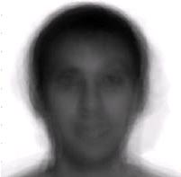
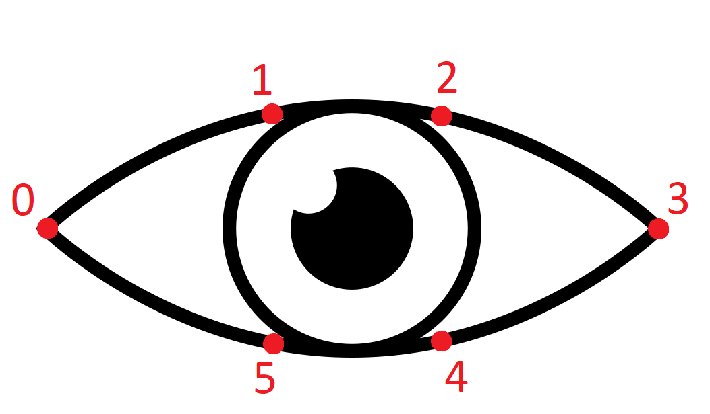
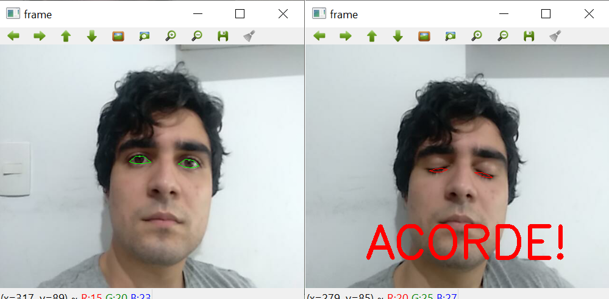

## Projeto Final - Detecção de Sono

Como o projeto final do curso de PDI, escolhemos trabalhar com a detecção facial de humanos. O nosso foco não foi dado à etapa de comparação e predição de faces aprendidas por um modelo de detecção, mas à uma aplicação sobre a detecção do que é uma face. 

Os algoritmos responsáveis por realizarem esse tipo de detecção são conhecidos como classificados e são amplamente estudados na literatura. Um exemplo de classificador estudado ao logo desse projeto, foi o classificador de Eigenfaces.

O classificador Eigenfaces se baseia no PCA (Principal Component Analysis), um procedimento estatístico para diminuir a dimensionalidade de características de uma grande quantidade de informação, para conjuntos menores de características conhecidas. Analogamente poderíamos citar o funcionamento bastante parecido de uma Transformada de Fourier: A partir de um sinal obtido, podemos realizar a sua decomposição em várias funções oscilatórias com parâmetros bem conhecidos, como amplitude e frequência. 

O Funcionamento do Eigenfaces
- A partir de um banco de faces, é realizada uma "sobreposição" de todas as imagens a fim de gerar uma "Face Média" (FM) do banco. Essa FM contém, ao mesmo tempo, todas as característica identitárias dos individuos que a compõe. A seguir podemos visualizar um exemplo de FM.

<div align="center">

</div>
<div align="center">
<figcaption>Exemplo de Eigenfaces.</figcaption>
</div>

- Essa FM agora é um conjunto robusto de informações e utilizamos o PCA para separar quais componentes principais são as componentes identitárias do sujeito: Uma componente pode estar associada a barba, outra à óculos, outra à ausência de cabelos, etc. 
- Na fase de treinamento, o modelo é responsável por separar essas componentes e relacionar sujeitos à componentes.
- Na fase de detecção, podemos atribuir pesos às características e comparar, quais característica tem maior influência na identidade de um sujeito. Assim podemos detectar, quantitativamente, que os sujeitos que tem maiores pesos associados às características, são os sujeitos mais parecidos. 

As operações realizadas são puramente estatísticas e bem mais complexas, a explicação acima tem o intuito de facilitar o entendimento.

Indo de encontro ao intuito deste trabalho, o objetivo não seria treinar um modelo e realizar a detecção dos individuos, mas utilizar as componentes identitárias de um modelo pré treinado, para definir marcos faciais e agir sobre eles. No caso em questão, poderíamos utilizar um Eigenfaces para definir as componentes olho, boca e nariz e detectar essas características. Não para uma identificação de individuos, mas para uma identificação visual da existencia ou não, de um olho, boca ou nariz, na imagem analisada. Seguindo esse exemplo, teríamos os seguintes passos:

- A entrada do nosso algoritmo seriam as imagens da webcam;
- Essas imagens seriam comparadas com um Eigenfaces a fim de detectar se existem principais componentes do tipo olhos, bocas ou narizes nas imagens;
- Após identificar e traçar um limiar nessas regiões, realizar alguma operação baseada na coleta desses dados.

No projeto em questão foi utilizado o classificador de 68 pontos da biblioteca Dlib. Esse classificador trabalha assim como descrito acima, utilizando uma base pré treinada para traçar marcos faciais especificos: Sobrancelhas, olhos, nariz, boca e mandíbula. Os contornos das regiões em questão são realizados por retas e os encontros entre essas retas são os pontos, sendo 68 ao total. 

Focamos nossa atenção especificamente aos olhos de forma a aplicar a detecção à alguma operação. O algoritmo em questão verifica se o individuo está de olhos fechados ou abertos e envia um sinal de alerta em caso de olhos fechados, podendo simbolizar um dispositivo para evitar que motoristas durmam ao volante. 

### Código

```python

import cv2
import numpy as np
import dlib
import matplotlib.pyplot as plt
from scipy.spatial import distance as dist

classificador_dlib_68_path = "classificadores/shape_predictor_68_face_landmarks.dat"
classificador_dlib = dlib.shape_predictor(classificador_dlib_68_path)
detector_face = dlib.get_frontal_face_detector()

````

```python

def pontos_marcos_faciais(imagem):
    retangulos = detector_face(imagem, 1)
    
    if len(retangulos) == 0:
        return None
    
    marcos = []
    
    for ret in retangulos:
        marcos.append(np.matrix([[p.x, p.y] for p in classificador_dlib(imagem,ret).parts()]))
    
    return marcos 
```
A função ```pontos_marcos_faciais()``` utiliza como prerrequisito, a detecção de face. Dessa forma, caso não haja um retângulo contendo uma face na imagem, o método não chamará o classificador. Assim, as coordenadas dos pontos delimitados pelo retângulo são reunidas por meio da função ```parts()``` do classificador e retorna esse conjunto de pontos que representam os marcos faciais.

```python
def aspecto_razao_olhos(pontos_olhos):
    
    a = dist.euclidean(pontos_olhos[1], pontos_olhos[5])
    b = dist.euclidean(pontos_olhos[2], pontos_olhos[4])
    c = dist.euclidean(pontos_olhos[0], pontos_olhos[3])
    
    aspecto_razao = (a + b)/(2.0 * c)
    
    return aspecto_razao
```
A função acima pega os 6 pontos de cada um dos olhos e realiza calcula a distância euclidiana de 3 pares de pontos, da forma que é representado nas imagens à seguir. Após isso, é calculado a taxa de abertura dos olhos com esses valores para saber se eles estão abertos ou fechados na câmera.

<div align="center">

</div>
<div align="center">
<figcaption>Representação aproximada dos marcos faciais em um dos olhos.</figcaption>
</div>

<div align="center">

</div>
<div align="center">
<figcaption>Representação das distâncias euclidianas utilizadas.</figcaption>
</div>


```python


def anotar_marcos_casca_convexa(imagem, marcos, ar_olho_esq, ar_olho_dir):
    retangulos = detector_face(imagem, 1)
    
    if len(retangulos) == 0:
        return None
    
    for idx, ret in enumerate(retangulos):
        marco = marcos[idx]
        if ((ar_olho_esq > 0.25)) and (ar_olho_dir > 0.25):
            pontos = cv2.convexHull(marco[OLHO_ESQUERDO])
            cv2.drawContours(imagem, [pontos], 0, (0,255,0), 1)
        
            pontos = cv2.convexHull(marco[OLHO_DIREITO])
            cv2.drawContours(imagem, [pontos], 0, (0,255,0), 1) 
            
        elif ((ar_olho_esq <= 0.20)) and (ar_olho_dir <= 0.20):
            pontos = cv2.convexHull(marco[OLHO_ESQUERDO])
            cv2.drawContours(imagem, [pontos], 0, (0,0,255), 1)
        
            pontos = cv2.convexHull(marco[OLHO_DIREITO])
            cv2.drawContours(imagem, [pontos], 0, (0,0,255), 1)
    
    return imagem
```

Essa etapa é importante para dar uma representação visual para quem está usando, pois essa função serve para desenhar o contorno dos olhos. Para isso, ele interliga os pontos de cada um dos olhos para formar uma casca convexa representando a abertura dos olhos. Ela também só realiza o desenho caso o ```detector_face()``` tenha encontrado alguma, além de usar o valor do aspecto de razão como referência para colorir a casca nos olhos: Caso o valor seja maior que 0.20, aparece verde, e caso seja igual ou menor, é pintado em vermelho.

```python

def padronizar_imagem(frame):
    frame = cv2.cvtColor(frame, cv2.COLOR_BGR2RGB)
    frame = cv2.resize(frame, (500, 400))
    return frame
```

A função acima tem o objetivo, como já diz, de padronizar a janela de exibição para 500 x 400, isso pode ser mudado de acordo com a necessidade do video a ser detectado. Porém, é bastante satisfatório para o formato da câmera utilizada.

```python

OLHO_DIREITO = list(range(36,42))
OLHO_ESQUERDO = list(range(42,48))

video = cv2.VideoCapture(0)
  
while(True):
      
    captura_ok, frame = video.read()
    frame = cv2.cvtColor(frame, cv2.COLOR_BGR2RGB)
    
    if captura_ok:
        frame = padronizar_imagem(frame)
        marcos_faciais = pontos_marcos_faciais(frame)
        
        if marcos_faciais is not None:
            
            ar_olho_esq = aspecto_razao_olhos(marcos_faciais[0][OLHO_ESQUERDO])
            ar_olho_dir = aspecto_razao_olhos(marcos_faciais[0][OLHO_DIREITO])
            
            frame = anotar_marcos_casca_convexa(frame, marcos_faciais, ar_olho_esq, ar_olho_dir)
            
            if ((ar_olho_esq <= 0.20)) and (ar_olho_dir <= 0.20):
                cv2.putText(frame, "ACORDE!", (100, 350), cv2.FONT_HERSHEY_SIMPLEX, 2.5, (0,0,255), 5)
            
        cv2.imshow('frame', frame)
      
        if cv2.waitKey(1) & 0xFF == ord('q'):
            break
  
video.release()
cv2.destroyAllWindows()
```

Esse final é usado para chamar as funções para agrupar os pontos dos olhos, desenhá-los na tela e calcular a taxa de abertura dos olhos. Esse valor também é utilizado para exibir um texto escrito "Acorde" quando a taxa é igual ou menor que 0.20. Assim, uma janela com a câmera e a cascava convexa é desenhada em tempo real caso haja um rosto e se os olhos estiverem fechados, a mensagem aparecerá e a casca se tornará vermelha. Ao final, para fechar a janela, basta apertar a tecla "Q".

<div align="center">

</div>
<div align="center">
<figcaption>Demonstração da utilização do programa com olhos abertos e fechados.</figcaption>
</div>

