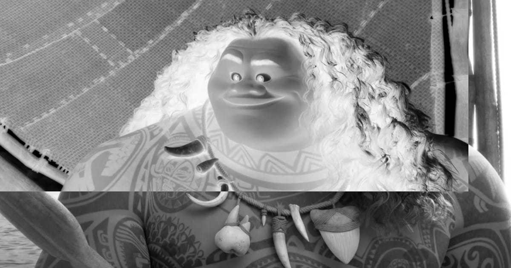
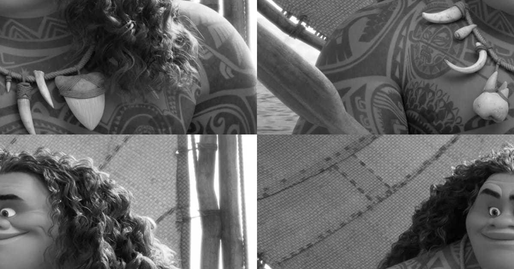
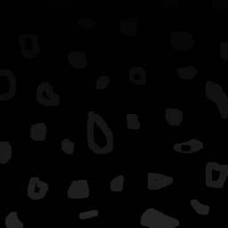
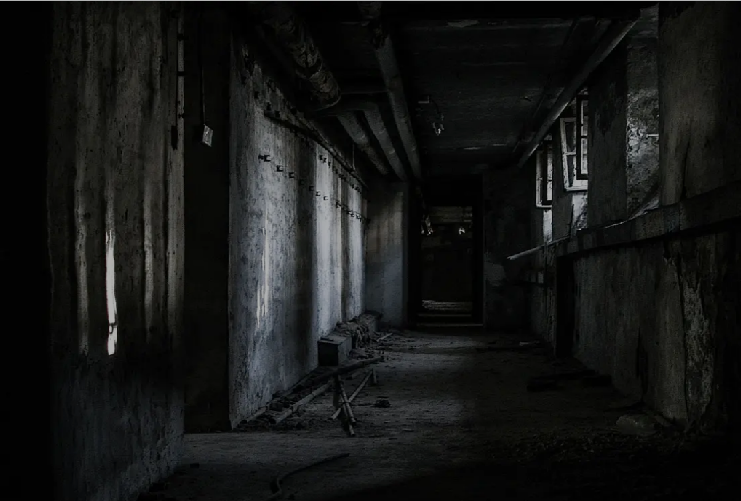
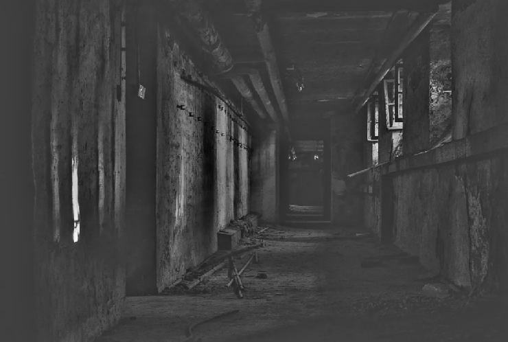

# Digital_Image_Processing

Esta página é dedicada à publicar os trabalhos realizados para a disciplina de Processamento Digital de Imagens, ministrada pelo professor Agostinho Brito, e realizado pelos alunos Rhendson Alexandre e Mário Marques, utilizando a biblioteca OpenCV em linguagens como Python e C++.

## 1. Manipulando Pixels de uma Imagem

### 1.1. Inverter Cores da Região Especificada

Primeiramente, pegaremos a imagem do personagem Maui de Moana para realizar a primeira manipulação, a de selecionar a área de um retângulo dentro da imagem a qual determinará a área que terá as cores invertidas.
<div align="center">

</div>
<div align="center">
<figcaption>Imagem Original</figcaption>
</div>

```python
from tempfile import tempdir
import numpy as np
import cv2 as cv

def showImage( img ):
    from matplotlib import pyplot as plt
    plt.imshow(img)
    plt.show()
    
def getColor(img, i, j):
    return img.item(i, j, 0), img.item(i, j, 1), img.item(i, j, 2)

```
O programa começa chamando as bibliotecas necessárias, criando uma função ```showImage()```, usada apenas para plotar a imagem recebida como parâmetro, e a função ```getColor()```, a qual armazenas os canais de cores da imagem separadamente.
```python
def setColor(img, i, j, b, g, r):
    img.itemset((i, j, 0), b)
    img.itemset((i, j, 1), g)
    img.itemset((i, j, 2), r)
    return 

def invertRegions( img ):
    y1 = input('y1: ')
    x1 = input('x1: ')
    y2 = input('y2: ')
    x2 = input('x2: ')

    rectangle = img[int(y1):int(y2), int(x1):int(x2)]
    altura, largura = rectangle.shape

    for i in range (0, altura):
        for j in range(0, largura):
            rectangle.itemset((i, j), 255-(rectangle.item(i, j)))

    img[int(y1):int(y2), int(x1):int(x2)] = rectangle

    cv.imwrite("imgs/maui_inverted.png", img)

    return img 

img = cv.imread("imgs/maui.jpg", 0)
showImage(invertRegions(img))
    
    
```
Em seguida, a função ```setColor()``` seleciona a área a ser modificada de acordo com os inputs do usuário usando a função ```invertRegions()```, a qual também realiza a inversão das cores ponto a ponto com o looping. Ao final de tudo, a imagem será salva em tons de cinza e com as cores invertidas, como no exemplo abaixo:

<div align="center">

</div>
<div align="center">
<figcaption>Imagem com cores invertidas e em tons de cinza</figcaption>
</div>

### 1.2. Trocar Regiões da Imagem

Se baseando novamente na mesma imagem original, este algoritmo troca posições dividindo a imagem em 4 pedaços iguais e embaralhando-os. Para isso, as mesmas bibliotecas do exercício 1.1 serão usadas.

```python
from tempfile import tempdir
import numpy as np
import cv2 as cv

def showImage( img ):
    from matplotlib import pyplot as plt
    plt.imshow(img)
    plt.show()

def cutOffQuarter( img, quarter ):
    altura, largura = img.shape

    first_quarter = img[0:int(altura/2), 0:int(largura/2)]
    second_quarter = img[0:int(altura/2), int(largura/2):largura]
    third_quarter = img[int(altura/2):altura, 0:int(largura/2)]
    fourth_quarter = img[int(altura/2):altura, int(largura/2):largura]

    if quarter == 1 :    
        return first_quarter 
    elif quarter == 2 :    
        return second_quarter 
    elif quarter == 3 :    
        return third_quarter 
    elif quarter == 4 :    
        return fourth_quarter 
```
A primeira grande mudança em relação ao exercício anterior é a função ```cutOffQuarter()``` a qual divide a imagem original em 4 pedaços iguais usando metade da altura e de largura para realizar os cortes nomeados de 1 a 4.
```python

def trocaRegioes( img ):
    cv.imwrite("imgs/temp_shift.png", img)
    tempImg = cv.imread("imgs/temp_shift.png", 0)

    altura, largura = img.shape

    tempImg[0:int(altura/2), 0:int(largura/2)] = cutOffQuarter(img, 4)
    tempImg[0:int(altura/2), int(largura/2):largura] = cutOffQuarter(img, 3)
    tempImg[int(altura/2):altura, 0:int(largura/2)] = cutOffQuarter(img, 2)
    tempImg[int(altura/2):altura, int(largura/2):largura] = cutOffQuarter(img, 1)

    return tempImg

def main():
    img = cv.imread("imgs/maui.jpg", 0)
    cv.imwrite("imgs/maui_shifted.png", trocaRegioes(img))
    showImage(trocaRegioes(img))

main()
```
A segunda grande parte do algoritmo é focado na função ```trocaRegioes()```, que pega os parâmetros obtidos por meio da função anterior ao calcular o tamanho de pixels máximos de altura e largura, copia a imagem original em tons de cinza para um arquivo temporário de imagem ```temp_sift.png``` e usar ela de base para trocar a posição dos pedaços gerados e salvar o resultado em uma outra imagem, disponível abaixo:

<div align="center">

</div>
<div align="center">
<figcaption>Imagem com as regiões trocadas e em tons de cinza</figcaption>
</div>

## 2. Rotulação de Objetos usando Floodfill

<div align="center">

</div>
<div align="center">
<figcaption>Imagem com as bolhas a serem rotuladas</figcaption>
</div>

```python
from turtle import color
import numpy as np
import cv2 as cv

img = cv.imread("imgs/bolhas.png", 0)

floodfill = img.copy()

h, w = img.shape[:2]
mask = np.zeros((h+2, w+2), np.uint8)

```
Após carregar as bibliotecas necessárias, a imagem bolhas.png é lida e copiada para uma variável chamada floodfill. Um outro ponto importante para a execução do programa é a criação uma máscara
a qual é usada para varrer a figura e encontrar as bordas das bolhas.

```python

colorToFill = 1
for i in range (0, h):
    for j in range(0, w):
        if (img.item(i, j) == 255):
            cv.floodFill(floodfil, mask, (j,i), colorToFill)
            if (img.item(i+1, j+1) == colorToFill):
                colorToFill += 1

cv.imshow('Mask', mask)
cv.imshow('Original', img)
cv.imshow('FloodFill', floodfill)

cv.waitKey()

cv.destroyAllWindows()

```
Assim, com a máscara pronta, o algoritmo realiza uma série de loopings que varrem a figura completamente utilizando a máscara como base rotulando as bolhas conforme suas bordas.

<div align="center">

</div>
<div align="center">
<figcaption>Imagem das bolhas com o floodfil</figcaption>
</div>

## 3. Equalização de Histogramas

O algorítmo à seguir pega o video capturado pela câmera e mostra um histograma equalizado dessa captura em tons de cinza.

```python

import numpy as np
from matplotlib import pyplot as plt
import cv2 as cv

capture = cv.VideoCapture(0)

fig, ax = plt.subplots()
ax.set_title('Histogram (grayscale)')
ax.set_xlabel('Bin')
ax.set_ylabel('Frequency')

```
A câmera de video do computador passa a capturar as imagens e as armazena na variável "capture". Após isso, a preparação para o plot do histograma é realizado em uma janela própria.

```python

lw = 3
alpha = 0.5
bins = 64

lineGray, = ax.plot(np.arange(bins), np.zeros((bins,1)), c='k', lw=lw)

ax.set_xlim(0, bins-1)
ax.set_ylim(0, 1)
plt.ion()
plt.show()


while True:
    (grabbed, frame) = capture.read()

    if not grabbed:
        break


numPixels = np.prod(frame.shape[:2])

gray = cv.cvtColor(frame, cv.COLOR_BGR2GRAY)
cv.imshow('Grayscale', gray)
histogram = cv.calcHist([gray], [0], None, [bins], [0, 255]) / numPixels
lineGray.set_ydata(histogram)

fig.canvas.draw()

cv.waitKey(1)

capture.release()
cv.destroyAllWindows()

```

## 6. Filtragem Homomórfica

O algorítmo a seguir é utilizado para realizar um filtro homomórfico por meio de uma filtragem no domínio da frequência, de uma forma que nossa imagem mal iluminada tenha os valores de iluminação alterados, como a reflectância e iluminância, com o objetivo de melhorar sua visualização.
 
<div align="center">

</div>
<div align="center">
<figcaption>Imagem com má iluminação a ser modificada.</figcaption>
</div>

```cpp

#include <iostream>
#include <opencv2/opencv.hpp>
#include <opencv2/imgproc/imgproc.hpp>

using namespace cv;
using namespace std;

float gl = 0; int gl_slider = 0; int gl_slider_max = 100;
float gh = 0; int gh_slider = 50; int gh_slider_max = 100;
float d0 = 0; int d0_slider = 50; int d0_slider_max = 100;
float c = 0; int c_slider = 5; int c_slider_max = 100;

char TrackbarName[50];

cv::Mat imaginaryInput, complexImage, multsp;
cv::Mat padded, filter, mag;
cv::Mat image, imagegray, tmp, magI;
cv::Mat_<float> realInput, zeros, ones;
cv::Mat backgroundImage;
std::vector<cv::Mat> planos;

float mean;
char key;
int dft_M, dft_N;

int dft_M = cv::getOptimalDFTSize(image.rows);
int dft_N = cv::getOptimalDFTSize(image.cols);

```
O algorítmo prepara os valores das barras de ajustes dos parâmetros GammaL, GammaH, D0 e C para o filtro, além de inicializar as matrizes necessárias para as operações.

```cpp

void deslocaDFT(Mat& image) {
    Mat tmp2, A, B, C, D;
    
    image = image(Rect(0, 0, image.cols & -2, image.rows & -2));
    int cx = image.cols / 2;
    int cy = image.rows / 2;
    
    A = image(Rect(0, 0, cx, cy));
    B = image(Rect(cx, 0, cx, cy));
    C = image(Rect(0, cy, cx, cy));
    D = image(Rect(cx, cy, cx, cy));

    A.copyTo(tmp2);  D.copyTo(A);  tmp2.copyTo(D);
    C.copyTo(tmp2);  B.copyTo(C);  tmp2.copyTo(B);
}

```
A função acima foi implementada para realizar o passo de trocar as regiões da imagem, especificamente as regiões A com a D e a B com a C, devido a facilitação que esta operação trará quando trabalhamos no espectro de Fourier.

```cpp

void on_trackbar_homomorphic(int, void*) {
    gl = (float)gl_slider / 100.0;
    gh = (float)gh_slider / 100.0;
    d0 = 25.0 * d0_slider / 100.0;
    c = (float)c_slider / 100.0;

    cout << "gl = " << gl << endl;
    cout << "gh = " << gh << endl;
    cout << "d0 = " << d0 << endl;
    cout << "c = " << c << endl;

    image = imread("homomorfico.png");
    cvtColor(image, imagegray, COLOR_BGR2GRAY);
    imshow("original", imagegray);
    
    copyMakeBorder(imagegray, padded, 0, dft_M - image.rows, 0, dft_N - image.cols, BORDER_CONSTANT, Scalar::all(0));

```

Ajusta os valores dos sliders e sua formatação na imagem a ser visualizada, para isso ele lê a imagem a sofrer a filtragem e cria uma margem para encaixar os sliders dos parâmetros. 
    
```cpp

    planos.clear();
    realInput = Mat_<float>(padded);
    planos.push_back(realInput);
    planos.push_back(zeros);
    merge(planos, complexImage);

    dft(complexImage, complexImage);

    deslocaDFT(complexImage);

    for (int i = 0; i < tmp.rows; i++) {
        for (int j = 0; j < tmp.cols; j++) {
            float d2 = (i - dft_M / 2) * (i - dft_M / 2) + (j - dft_N / 2) * (j - dft_N / 2);
            //cout << "d2 = " << d2 << endl;
            tmp.at<float>(i, j) = (gh - gl) * (1.0 - (float)exp(-(c * d2 / (d0 * d0)))) + gl;
        }
    }

    Mat comps[] = { tmp, tmp };
    merge(comps, 2, filter);
    mulSpectrums(complexImage, filter, complexImage, 0);

    deslocaDFT(complexImage);

    idft(complexImage, complexImage);
    planos.clear();
    split(complexImage, planos);
    
    normalize(planos[0], planos[0], 0, 1, NORM_MINMAX);
    imshow("filtrada", planos[0]);

}

```

O resto da função chama a DeslocaDFT e realiza a filtragem homomórfica na imagem com as regiões trocadas, além realizar um filtro frequencial e fazer a transformada inversa, com uma normalização da parte real para a exibição na tela.
    
```cpp

int main(int argc, char** argv) {

    namedWindow("original", WINDOW_NORMAL);
    namedWindow("filtrada", WINDOW_NORMAL);

    if (argc != 2) {
        cerr << "Usage: " << argv[0] << " <img_path>" << endl;
        return 1;
    }

    image = imread("homomorfico.png");

    dft_M = getOptimalDFTSize(image.rows);
    dft_N = getOptimalDFTSize(image.cols);
    
    copyMakeBorder(image, padded, 0, dft_M - image.rows, 0, dft_N - image.cols, BORDER_CONSTANT, Scalar::all(0));

    zeros = Mat_<float>::zeros(padded.size());
    complexImage = Mat(padded.size(), CV_32FC2, Scalar(0));
    filter = complexImage.clone();
    tmp = Mat(dft_M, dft_N, CV_32F);

    sprintf(TrackbarName, "gamma_l"); 
    createTrackbar(TrackbarName, "filtrada", &gl_slider, gl_slider_max, on_trackbar_homomorphic);
    sprintf(TrackbarName, "gamma_h");
    createTrackbar(TrackbarName, "filtrada", &gh_slider, gh_slider_max, on_trackbar_homomorphic);
    sprintf(TrackbarName, "d_zero");
    createTrackbar(TrackbarName, "filtrada", &d0_slider, d0_slider_max, on_trackbar_homomorphic);
    sprintf(TrackbarName, "c");
    createTrackbar(TrackbarName, "filtrada", &c_slider, c_slider_max, on_trackbar_homomorphic);

    on_trackbar_homomorphic(100, NULL);

    while (1) {
        key = (char)waitKey(10);
        if (key == 27) break; // esc pressed!
    }

    return 0;
}

```

A função main ajusta toda a visualização e utiliza as outras funções criadas para ajustar os parâmetros da filtragem homomórfica, a qual a captura do resultado obtido se encontra abaixo. Fecha a janela após a tecla Esc ser apertada.

<div align="center">

</div>
<div align="center">
<figcaption>Imagem após a filtragem.</figcaption>
</div>
